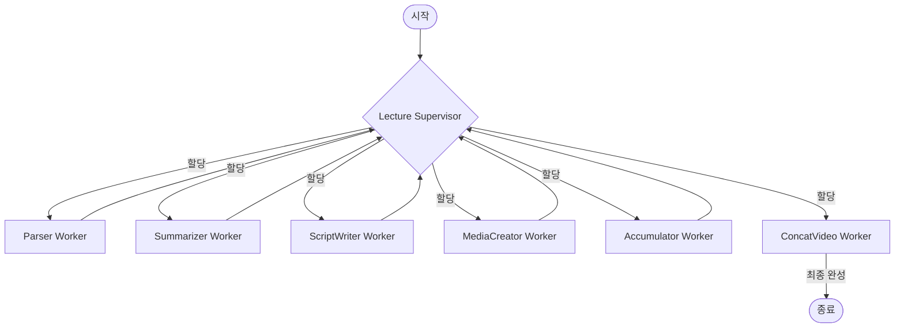
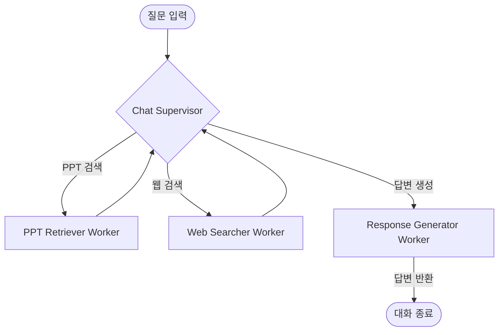

# AI Lecture Agent v2.0

PPT 파일을 업로드하면 핵심 내용을 요약하고 강의 대본을 작성한 뒤, TTS(음성)와 결합해 동영상 강의로 만들어주는 AI 에이전트 서비스입니다.
업로드한 PPT 내용을 바탕으로 질의응답을 수행하고, 필요시 실시간 웹 검색까지 알아서 수행하는 RAG 챗봇 기능도 포함되어 있습니다.

## 배포

https://ai-lecture-agent-zggvveffn5gcgt85kgo7xw.streamlit.app/

## 주요 기능

* **강의 영상 자동 제작**: PPT 파싱 -> 내용 요약 -> 스크립트 작성 -> TTS 생성 -> 동영상 병합 과정을 자동으로 처리합니다.
* **LangGraph 기반 Multi-Agent**: 하나의 거대한 코드가 아니라, Supervisor(감독관) 에이전트가 상황을 판단해 각 전문 Worker 에이전트에게 업무를 할당하는 구조로 설계했습니다.
* **지능형 RAG 챗봇**: FAISS를 활용해 PPT 내부 지식을 검색하며, 슬라이드에 없는 내용이라고 판단되면 Tavily Search를 통해 웹을 검색한 후 종합해서 답변합니다.
* **실시간 에이전트 로그**: Streamlit UI에서 에이전트들이 현재 어떤 작업을 처리하고 있는지 실시간으로 확인할 수 있습니다.

## 아키텍처

### 강의 영상 제작 (Lecture Supervisor)


### RAG 챗봇 (Chat Supervisor)


## 기술 스택

* **UI & 백엔드**: Streamlit
* **AI 프레임워크**: LangChain, LangGraph
* **LLM & TTS**: OpenAI GPT-4o-mini, OpenAI TTS-1
* **검색 & DB**: Tavily Search API

## 로컬 실행 방법

`uv` 패키지 관리자를 사용해 빠르게 세팅할 수 있습니다.

```bash
# 가상환경 생성 및 활성화
uv venv
.venv\Scripts\activate

# 패키지 설치 및 실행
uv pip install -r requirements.txt
streamlit run app.py
```
